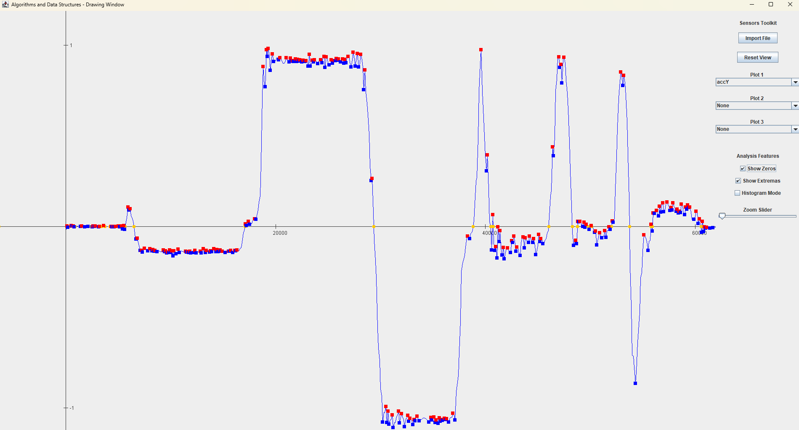
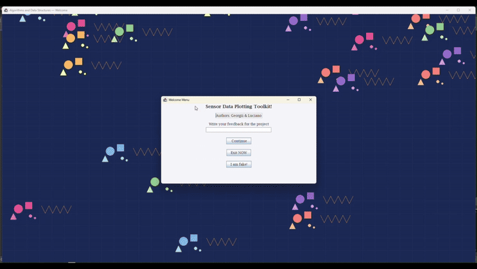
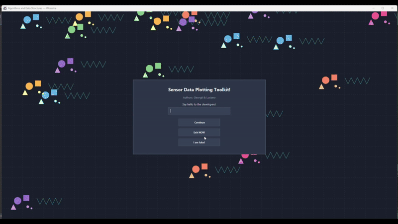
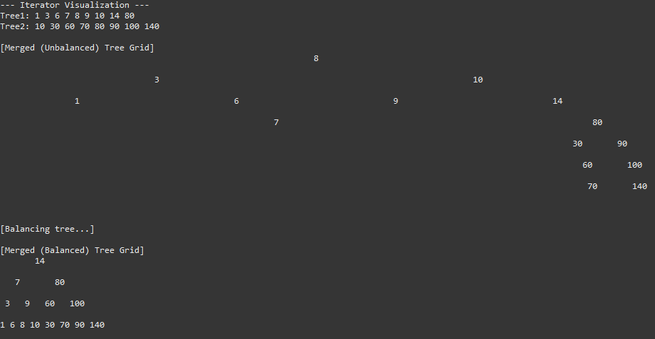

# HAW Project Collaboration — Algorithms and Data Structures

**Authors:**
- Georgii Molyboga ([@Georgemolyboga](https://github.com/Georgemolyboga/))
- Luciano Carricart ([@lcarricart](https://github.com/lcarricart/))

**Institution:** Hamburg University of Applied Sciences (HAW Hamburg)  
**Program:** Information Engineering  
**Course:** Algorithms and Data Structures  
**Date:** November 2024

---

## Overview

This repository documents a collaborative programming journey through Java-based implementations of fundamental algorithms and data structures. The projects progress from GUI-based sensor data visualization to advanced data structure implementations, demonstrating practical applications of theoretical concepts learned in the course.

---

## Project Evolution

```
LAB1 (Plotting) → LAB2.1 (+ Sorting) → LAB2.2 (Event-driven Sorting + Modern UI) → LAB3 (Binary Trees)
     ↓                    ↓                            ↓                                 ↓
  Visualization    Algorithm Analysis             UX Enhancement                     Data Structures
```

Each iteration builds upon previous work, demonstrating incremental development —key practices in software engineering.

---

## Project Summaries

**1. LAB 1: Sensor Data Plotting Toolkit**



*Objective:* Build a comprehensive GUI application for visualizing multi-channel sensor telemetry data.

---

**2. LAB 2.1: Old GUI — Sorting Algorithms & 3D Visualization**



*Objective:* Extend LAB 1 with sorting algorithm analysis and 3D sensor visualization capabilities.

---

**3. LAB 2.2: New GUI — Modern Theme Enhancement**



*Objective:* Refactor LAB 2.1 with a professional, modern dark-themed user interface.

---

**4. LAB 3: Sorted Binary Tree Implementation**



*Objective:* Implement a generic sorted binary tree data structure with comprehensive operations and visualizations.

---

## Learned Concepts
This collaborative project series successfully demonstrates:

1. **Data Structures**: Practical implementation of linked lists, binary search trees, and array-based structures
2. **Algorithms**: Sorting algorithms (QuickSort, SelectionSort), tree operations, and search algorithms
3. **Software Engineering**: Design patterns, abstraction, inheritance, and modular architecture
4. **GUI Programming**: Event-driven applications with custom graphics and user interactions
5. **Performance Analysis**: Algorithm efficiency tracking through swap and comparison counting

### Design Patterns
- **Template Method Pattern**: AbstractSort class hierarchy
- **Iterator Pattern**: TreeIterator for sorted binary tree
- **Observer Pattern**: Event listeners for GUI interactions

### Java Features
- **Generics**: Type-safe collections and data structures
- **Collections Framework**: ArrayList, LinkedList, Queue interfaces
- **Swing/AWT**: Complete GUI framework with custom painting
- **Abstract Classes & Interfaces**: Extensible architecture

### Libraries (No External Dependencies)
- **Language**: Java
- **GUI Framework**: javax.swing.*, java.awt.*
- **Data Structures**: java.util.* (ArrayList, LinkedList, Queue, Iterator)
- **I/O Operations**: java.io.*, java.nio.*
- **Geometry**: java.awt.geom.* (Point2D, Rectangle2D)

---

**Repository:** [00-HAW-University/03-AlgorithmsDataStructures](c:\Users\luchi\source\repos\lcarricart\00-HAW-University\03-AlgorithmsDataStructures)  
